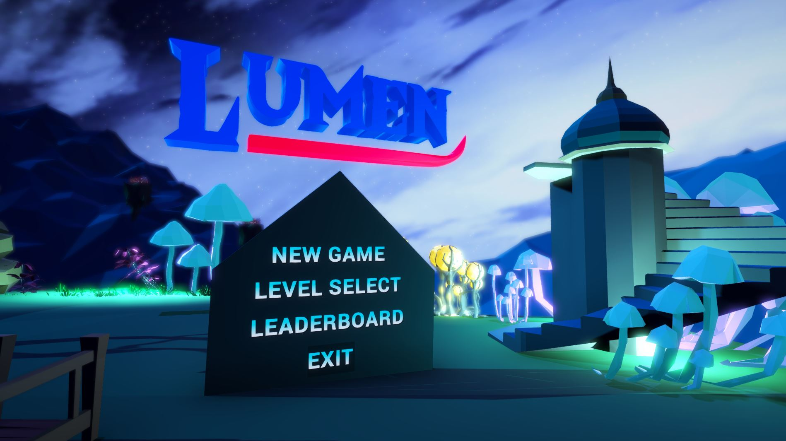

# Lumen

Video Game project for CSC404 - Introduction to Video Game Design with Prof. Steve Engels.

# Details

- Built in Unity 2018.3.2
- Team of 7 - 4 programmers, 2 artists, and a music producer.

# About

Lumen is a 3D platformer with growing/shrinking mechanics and an emphasis on fast-paced “speedrunning” gameplay using a dynamic movement system.

The backdrops for Lumen are composed of natural, worn-down environments with levels being made up of floating islands, mushrooms, mountains, and ruins lit up by bioluminescent hues of earthy greens and deep blues. Dangerous environments in the levels are marked by fiery orange and red hues.

The goal of the game is to go through the various levels as quickly as possible, with higher scores awarded for shorter completion times. Collectibles can be found “off the beaten path” in a manner such that the player has to make a tradeoff between completion time and the extra points earned from the collectible.

The player can traverse the levels using movement mechanics like double-jumping and wall-climbing. Certain routes through the level can become inaccessible depending on the size of the player, which changes based on the time they spend on surfaces that increase/decrease the player’s size.
